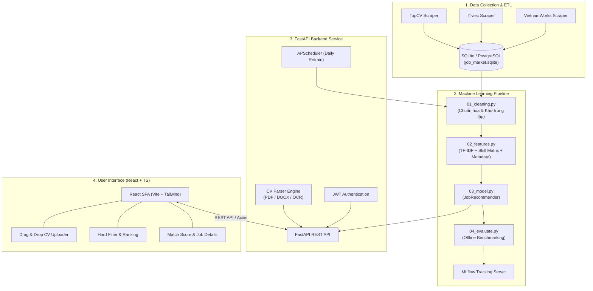

<div align="center">

# 🎯 IT Job Recommendation & Market Intelligence System

### *Hệ thống Phân tích Thị trường & Gợi ý Việc làm IT Thông minh với AI & MLOps*

[](https://python.org)
[](https://fastapi.tiangolo.com)
[](https://react.dev)
[](https://www.typescriptlang.org)
[](https://tailwindcss.com)
[](https://mlflow.org)
[](https://www.docker.com)
[](https://opensource.org/licenses/MIT)

</div>

---

## 🌟 Điểm nổi bật (Key Features)

- 🤖 **Multi-Channel Crawlers**: Tự động thu thập hàng ngàn tin tuyển dụng từ các sàn lớn nhất Việt Nam: **TopCV, ITviec, VietnamWorks** bằng công nghệ Anti-detect Browser (`DrissionPage`).
- 🧠 **Hybrid ML Recommendation Engine**:
  - Không gian đặc trưng đa chiều: **TF-IDF JD Content (50%)** + **Binary Skill Matching (35%)** + **Metadata Cấp bậc/Địa điểm/Lương (15%)**.
  - Xếp hạng thời gian thực dựa trên **Cosine Similarity** với cơ chế Hard-filtering (Mức lương, Cấp bậc, Địa điểm).
- 📄 **Universal CV Parsing (Trích xuất CV Đa năng)**:
  - Hỗ trợ tải lên định dạng **PDF** (`PyMuPDF`), Word **DOCX** (`python-docx`).
  - Hỗ trợ trích xuất chữ từ **Ảnh chụp / Scan CV** (`Pillow` + `pytesseract` OCR tiếng Việt & tiếng Anh).
  - Tự động nhận diện danh mục kỹ năng (Skill Extraction) từ nội dung CV.
- ⚡ **Fullstack Web Hiện đại**:
  - **Backend**: FastAPI hiệu năng cao, SQLAlchemy ORM, phân quyền JWT Token (Register/Login), quản lý hồ sơ và lịch sử tìm kiếm.
  - **Frontend**: React + TypeScript (Vite) + Tailwind CSS, giao diện kéo thả CV trực quan, responsive và mượt mà.
- 🔄 **MLOps & Pipeline Tự động**:
  - Tích hợp **MLflow** theo dõi thông số, độ đo và lưu trữ ma trận mô hình.
  - Tự động hóa lịch trình huấn luyện lại mô hình (Scheduled Retraining) với **APScheduler**.
- 🐳 **Containerized Deployment**: Sẵn sàng triển khai 1-click toàn bộ stack bằng **Docker & Docker Compose**.

---

## 🏗 Kiến trúc Hệ thống (System Architecture)



---

## 🔬 Hiệu năng Thuật toán (ML Benchmark Results)

Hệ thống được đánh giá qua chiến lược kiểm thử giả định (Pseudo Ground-Truth) trên tập dữ liệu tuyển dụng thực tế:

| Metric | K = 5 | K = 10 | K = 20 | Ý nghĩa |
| :--- | :---: | :---: | :---: | :--- |
| **Precision@K** | **97.8%** | **96.0%** | **92.5%** | Tỷ lệ công việc thực sự phù hợp trong top K gợi ý |
| **Recall@K** | 10.3% | 18.7% | 31.2% | Tỷ lệ công việc phù hợp được tìm thấy so với toàn bộ database |
| **NDCG@K** | **1.000** | **1.000** | **0.998** | Khả năng xếp hạng việc tốt nhất lên vị trí đầu tiên |
| **Catalog Coverage** | 15.6% | 26.4% | **41.3%** | Độ phủ công việc trong kho dữ liệu được hệ thống đề xuất |
| **Intra-List Diversity** | 0.541 | 0.549 | 0.558 | Độ đa dạng giữa các gợi ý (tránh lặp lại 1 kiểu công việc) |

---

## 📂 Cấu trúc Thư mục (Project Layout)

```text
IT-jobs-recommend-system/
├── backend/                       # ⚙️ Backend FastAPI
│   ├── api/
│   │   ├── models/                # SQLAlchemy & Pydantic Schemas
│   │   │   ├── database.py        # Bảng Users, CVs, History, SavedJobs
│   │   │   └── schemas.py         # Request/Response models
│   │   ├── routes/                # API Endpoints (auth, recommend, cvs, jobs, ...)
│   │   └── deps.py                # Database & JWT Dependency Injection
│   ├── ml/
│   │   ├── cv_parser.py           # Bộ đọc text từ PDF, DOCX, Ảnh (OCR)
│   │   ├── recommender.py         # Singleton Inference Engine
│   │   └── pipeline.py            # Scheduler & MLflow tracking integration
│   ├── main.py                    # FastAPI Application Entrypoint
│   └── requirements.txt           # Thư viện Python Backend
│
├── frontend/                      # 🖥️ Frontend React (Vite + TypeScript)
│   ├── src/
│   │   ├── components/            # UI Components (CVUploader, Auth, Cards, ...)
│   │   ├── contexts/              # Global State (AuthContext)
│   │   ├── pages/                 # RecommendPage, LoginPage, RegisterPage
│   │   ├── services/api.ts        # Axios client có cấu hình Token Interceptor
│   │   └── App.tsx                # Client Routing
│   └── package.json
│
├── recommendation/                # 🧠 ML Pipeline scripts độc lập
│   ├── 01_cleaning.py             # Làm sạch dữ liệu, chuẩn hóa lương, cấp bậc
│   ├── 02_features.py             # Sinh ma trận thưa TF-IDF + Skill Matrix
│   ├── 03_model.py                # Logic tính Cosine Similarity & Ranker
│   ├── 04_evaluate.py             # Đánh giá thuật toán (P@K, Recall, NDCG)
│   └── 05_run_pipeline.py         # Script chạy trọn vẹn ML pipeline
│
├── scrapers/                      # 🕷️ Web Scrapers (DrissionPage)
│   ├── scraper_topcv.py           # Cào tin tuyển dụng TopCV
│   ├── scraper_itviec.py          # Cào tin tuyển dụng ITviec
│   └── scraper_vnw.py             # Cào tin tuyển dụng VietnamWorks
│
├── database/                      # 🗄️ Lưu trữ Dữ liệu SQLite & Model Artifacts
│   ├── job_market.sqlite          # Cơ sở dữ liệu chính
│   ├── feature_matrix.npz         # Ma trận đặc trưng thưa (2032 x 8378)
│   ├── tfidf_vectorizer.pkl       # Bộ mã hóa TF-IDF đã huấn luyện
│   └── skill_vocab.pkl            # Từ điển kỹ năng công nghệ
│
├── docker-compose.yml             # 🐳 Chạy toàn bộ hệ thống bằng Docker
├── Dockerfile.backend             # Container build cho Backend + Tesseract OCR
├── Dockerfile.frontend            # Container build Nginx cho Frontend React
└── README.md                      # Tài liệu dự án
```

---

## 🚀 Hướng dẫn Cài đặt & Chạy Dự án

### Cách 1: Chạy 1-Click với Docker Compose *(Khuyên dùng)*

Yêu cầu máy đã cài [Docker](https://www.docker.com/) & [Docker Compose](https://docs.docker.com/compose/).

```bash
# 1. Clone repository
git clone https://github.com/danggvuu/IT-jobs-recommend-system.git
cd IT-jobs-recommend-system

# 2. Khởi động toàn bộ dịch vụ (Backend + Frontend + MLflow)
docker-compose up --build
```

Sau khi khởi động thành công:
- **Giao diện Web Ứng viên**: [http://localhost:3000](http://localhost:3000)
- **FastAPI Swagger Docs**: [http://localhost:8000/docs](http://localhost:8000/docs)
- **MLflow Tracking Dashboard**: [http://localhost:5001](http://localhost:5001)

---

### Cách 2: Chạy Thủ công (Manual Development Mode)

#### Bước 1: Khởi động Backend
```bash
# Tạo môi trường ảo & cài thư viện
python -m venv .venv
source .venv/bin/activate  # Trên Windows: .venv\Scripts\activate
pip install -r backend/requirements.txt

# Khởi chạy FastAPI Server (Reload tự động khi sửa code)
uvicorn backend.main:app --host 0.0.0.0 --port 8000 --reload
```

#### Bước 2: Khởi động Frontend
Mở một cửa sổ Terminal mới:
```bash
cd frontend

# Cài đặt Node modules
npm install

# Khởi chạy Vite Dev Server
npm run dev
```
Truy cập `http://localhost:5173` để trải nghiệm web.

---

## 📡 Danh sách API Endpoints Chính

| Phương thức | Đường dẫn API | Mô tả | Yêu cầu Auth |
| :--- | :--- | :--- | :---: |
| `POST` | `/api/v1/auth/register` | Đăng ký tài khoản mới | ❌ |
| `POST` | `/api/v1/auth/login` | Đăng nhập & lấy Bearer JWT Token | ❌ |
| `GET` | `/api/v1/auth/me` | Lấy thông tin người dùng hiện tại | ✅ |
| `POST` | `/api/v1/cvs/upload` | Tải lên file CV (PDF, DOCX, Ảnh) & chạy OCR | ✅ |
| `GET` | `/api/v1/user/my-cvs` | Xem danh sách CV đã lưu của tài khoản | ✅ |
| `POST` | `/api/v1/recommend` | Gợi ý việc làm theo CV Text hoặc CV ID | ✅ |
| `GET` | `/api/v1/user/my-history` | Xem lại các lượt gợi ý việc làm trước đây | ✅ |
| `GET` | `/api/v1/jobs` | Tra cứu danh sách việc làm (phân trang, lọc) | ❌ |
| `GET` | `/api/v1/analytics/summary` | Thống kê tổng số jobs, người dùng, tìm kiếm | ❌ |
| `GET` | `/api/v1/health` | Kiểm tra trạng thái server & model load | ❌ |

---

## 🛠️ Huấn luyện Lại Mô hình (Retraining Pipeline)

Khi cào thêm dữ liệu mới vào cơ sở dữ liệu, bạn có thể chạy lại quy trình làm sạch và cập nhật ma trận gợi ý bằng một lệnh:

```bash
python recommendation/05_run_pipeline.py
```
Toàn bộ ma trận vector hóa và các chỉ số đánh giá mới sẽ tự động được ghi đè an toàn vào thư mục `database/`.

---

## 👨‍💻 Tác giả & Đóng góp

- **Tác giả**: [Dang Vu (@danggvuu)](https://github.com/danggvuu)
- Mọi đóng góp, báo lỗi (Issues) hoặc Pull Request đều được hoan nghênh!

---

## 📝 Giấy phép (License)

Dự án được phân phối dưới giấy phép **MIT License**. Chi tiết xem tại [LICENSE](LICENSE).
